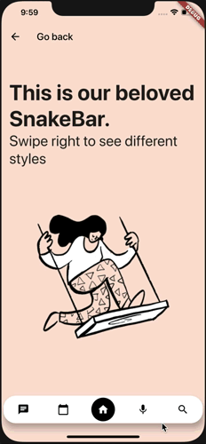
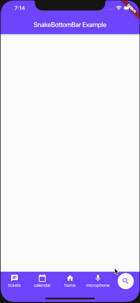
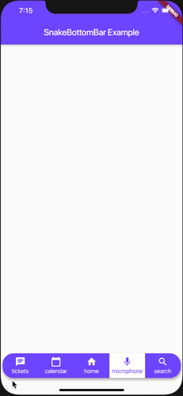
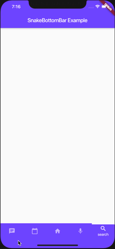
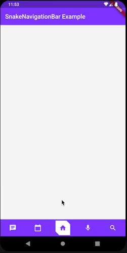

# SnakeNavigationBar

A new Flutter SnakeNavigationBar widget package.

## Preview







## Usage

To use this plugin, add flutter_snake_navigationbar as a dependency in your [pubspec.yaml](https://flutter.io/using-packages/) file.


## Properties

SnakeNavigationBar has a similar API to BottomNavigationBar and uses BottomNavigationBarItem to show items as well.
```
     Scaffold(
      bottomNavigationBar: SnakeNavigationBar(
        items: [
          BottomNavigationBarItem(icon: Icon(Icons.chat), title: Text('tickets')),
          BottomNavigationBarItem(icon: Icon(Icons.calendar_today), title: Text('calendar')),
          BottomNavigationBarItem(icon: Icon(Icons.home), title: Text('home')),
          BottomNavigationBarItem(icon: Icon(Icons.mic), title: Text('microphone')),
          BottomNavigationBarItem(icon: Icon(Icons.search), title: Text('search'))
        ],
      ),
``` 

```dart
      final List<BottomNavigationBarItem> items;

      /// If [SnakeBarStyle.floating] this color is
      /// used as background color of shaped view.
      /// If [SnakeBarStyle.pinned] this color just
      /// a background color of [SnakeNavigationBar] view
      final Color backgroundColor;
    
      /// This color represents a SnakeView , 
      /// unselected icons and labels color
      final Color selectedTintColor;
    
      ///You can customize color for selected icon and label
      final Color selectedIconTintColor;
    
      /// Whether the labels are shown for the selected [BottomNavigationBarItem].
      final bool showSelectedLabels;
    
      /// Whether the labels are shown for the unselected [BottomNavigationBarItem].
      final bool showUnselectedLabels;
    
      /// The index into [items] for the current active [BottomNavigationBarItem].
      final int currentIndex;
    
      /// Defines the [SnakeView] shape and behavior of a [SnakeNavigationBar].
      ///
      /// Default is [SnakeShape.circle]
      final SnakeShape snakeShape;
    
      /// Defines the layout and behavior of a [SnakeNavigationBar].
      ///
      /// See documentation for [SnakeBarStyle] for information on the
      /// meaning of different styles.
      ///
      /// Default is [SnakeBarStyle.pinned]
      final SnakeBarStyle style;
    
      /// You can define custom [ShapeBorder] with padding and elevation to [SnakeNavigationBar]
      ///
      /// IMPORTANT You can use custom shape only with [SnakeBarStyle.floating]
      final ShapeBorder shape;
      final EdgeInsets padding;
      final double elevation;
    
      /// Called when one of the [items] is tapped.
      final ValueChanged<int> onTap;
```


#### !! IMPORTANT !! if you use [SnakeShape.circle] then [showSelectedLabels] parameter will be always [FALSE]

    